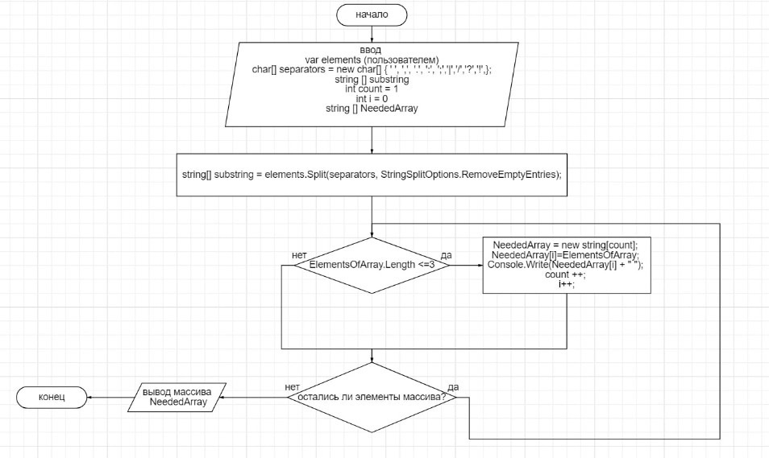

1.	Ввод нового массива
1.1.	 Даем пользователю возможность ввести в строку элементы массива. Поскольку мы не можем знать тип данных, которые введет пользователь (цифры, буквы или символы) используем неявно типизированный вид данных var
1.2.	 С помощью метода (.Split) и массива разделителей отделяем элементы массива и составляем из них новый массив substring
2.	Создание нужного массива
2.1.	 Вводим новые переменные count – чтобы инициализировать массив на определенное количество элементов и i – для того, чтобы обозначить место подходящего элемента массива в новом массиве
2.2.	 Создаем цикл foreach, который обработает каждый элемент массива по подходящим условиям (длина элемента меньше или равна 3)
2.3.	 Выводим нужные элементы на экран пользователя

****